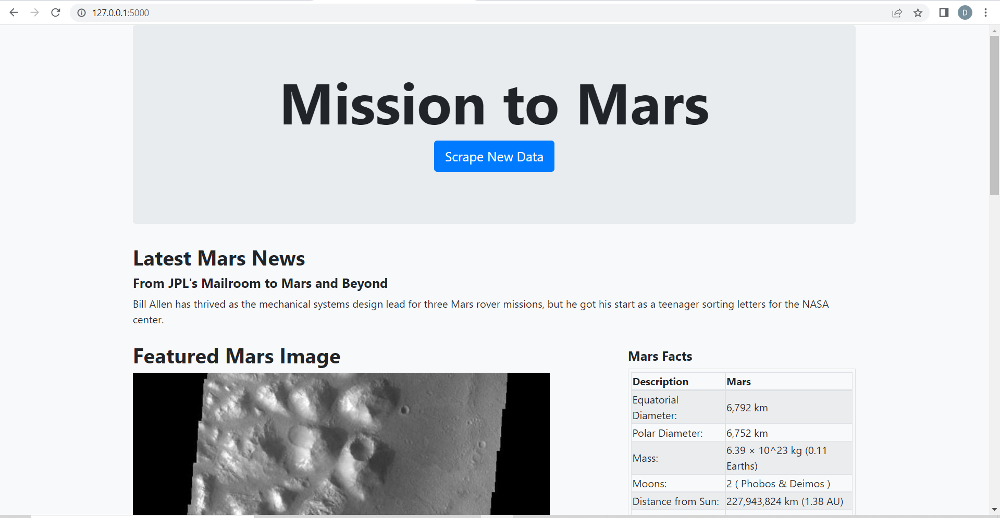
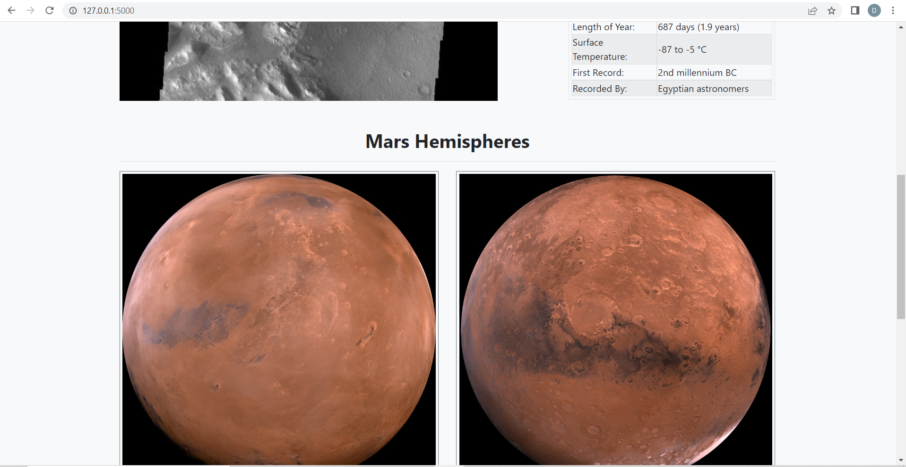
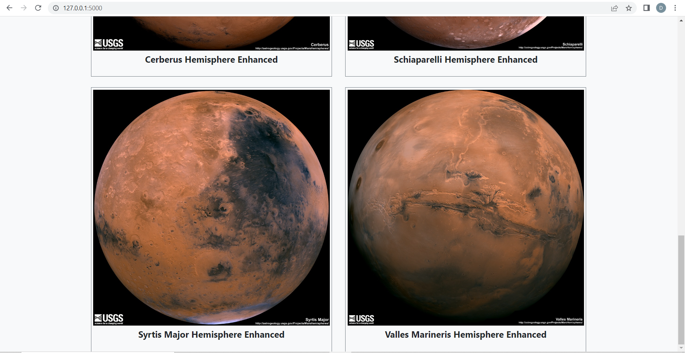

# Mission-to-Mars-Web-Scrapping

## Aim

To build a web application that scrapes various websites for data related to the Mission to Mars and displays the information in a single HTML page.

## Data Source

https://redplanetscience.com/
https://spaceimages-mars.com/
https://galaxyfacts-mars.com/
https://marshemispheres.com/

## Tools

Jupyter Notebook, BeautifulSoup, Splinter, Pandas, MongoDB, Flask, HTML

## Application Screenshots

 

 

 

